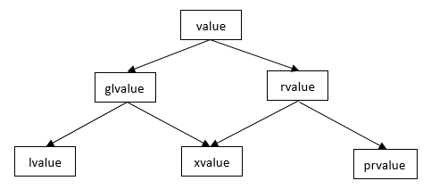

## 左值/右值/将亡值

C++11 以后的标准按值类别划分为：左值，将亡值(eXpiring value)，纯右值，其中左值和将亡值合称泛左值(generalized lvalue,glvalue)，将亡值和纯右值合称为右值，关系如下：



- 左值(left value,lvalue)
    
    能取地址的表达式
    
    - 函数名和变量名
    - 返回左值引用的函数调用
    - 前置自增/减运算符连接的表达式(`++i/--i`)
    - (复合)赋值运算符连接的表达式(a=b, a+=b)
    - 解引用表达式(*p)
    - 字符串字面值(”abc”)
- 纯右值(pure rvalue,pralue)
    
    除字符串以外的字面值，如100，false
    
    不具名的临时对象
    
    - 返回非引用类型的函数调用
    - 后置自增/减运算符连接的表达式(`i++/i--`)
    - 算数表达式(a+b, a&b, a<<b)
    - 逻辑表达式(a&&b, a||b, ~a)
    - 比较表达式(a==b, a≥b, a<b)
    - 取地址表达式(&a)
- 将亡值(expiring value,xvalue)
    
    伴随C++11标准的右值引用概念出现的，指返回一个右值引用的表达式。比如 std::move(x)，stsatic_cast<X&&>(x) 得到的结果
    
    - 返回右值引用的函数调用表达式
    - 转换为右值引用的调用表达

[https://www.jianshu.com/p/4538483a1d8a](https://www.jianshu.com/p/4538483a1d8a)

[https://zh.cppreference.com/w/cpp/language/value_category](https://zh.cppreference.com/w/cpp/language/value_category)

## 左值引用/右值引用

```cpp
int num = 10;
int &b = num;		// 正确
int &c = 10;		// 错误！

const int &d = num;		// 正确
const int &e = 10;		// 正确，常量左值引用可以操作右值

// 右值引用与左值引用一样也必须立即初始化，且只能用右值初始化
int &&a = num;		// 错误！右值引用不能初始化为左值
int &&b = 10;		  // 正确

// 和常量左值引用不同的是，右值引用可以对右值进行修改
int &&a = 10;
a = 100;			    //正确
/*** 要注意的是 a的类型是右值引用，指向一个右值，但a本身是左值 ***/
/*Things that are declared as rvalue reference can be lvalues or rvalues.
The distinguishing criterion is: if it has a name, then it is an lvalue.
Otherwise, it is an rvalue.*/

void process_value(int& i) {
  std::cout << "LValue processed: " << i << std::endl;
}
void process_value(int&& i) {
  std::cout << "RValue processed: " << i << std::endl;
}

int main() {
  int a = 0;
  process_value(a);
  int&& x = 3;
  process_value(x);

  process_value(5);
  process_value(std::move(a));
  process_value(std::move(x));
  return 0;
}
// output
// LValue processed: 0
// LValue processed: 3
// RValue processed: 5
// RValue processed: 0
// RValue processed: 3
```

## std::move

仅仅执行到右值类型的无条件转换；它没有“move”任何东西；

- 传递的是左值，推导为左值引用，仍旧static_cast转换为右值引用。
- 传递的是右值，推导为右值引用，仍旧static_cast转换为右值引用。

## std::forward

先熟悉以下概念

### 万能引用(universal reference)

如果一个变量或者参数被声明为**`T&&`**，其中T是**被推导**的类型，那这个变量或者参数就是universal reference。万能引用既可接收左值又可接收右值。

注意，只有发生类型推导才表示万能引用（比如模板参数传参，auto声明），否则就是右值引用。

```cpp
template <typename T>
void f(std::vector<T>&& param);     //param是一个右值引用
```

上面代码中，类型`T`会被推导，但`param`类型不是`T&&`，而是`std::vector<T>&&`。所以param不是万能引用，而是右值引用。

既然万能引用既能接收左值，也能接收右值，那么如何确定T的类型呢，编码机制为：

- 当左值实参被传入时，`T`被推导为**左值引用**
- 当右值被传入时，`T`被推导为**非引用**

```cpp
template<typename T> 
void f(T&&);

int i = 10;
f(i);   // 传入左值i, T 推导为 int&
f(1);   // 传入右值1, T 推导为 int
```

### 引用折叠(Reference Collapse)

如果间接的创建一个引用的引用，会发生引用折叠，除了右值引用的右值引用会折叠为右值引用，其它3种情况都折叠为左值引用，即：

- `X& &`、`X& &&`、`X&& &`都折叠成`X&`；
- `X&& &&`折叠为`X&&`；

上面代码中，`f(i);`编译器推断`T`的类型为`int&`，根据引用折叠规则，`void f(int& &&)将`推断为`void f(int&)`，因此，f被实例化为`void f<int&>(int&);`

下面再看一个例子：

```cpp
#include <iostream>
using namespace std;

template <typename T>
void func(T& param) {
  cout << "call lvalue func" << endl;
}
template <typename T>
void func(T&& param) {
  cout << "call rvalue func" << endl;
}

template <typename T>
void warp(T&& param) {
  func(param);
}

int main() {
  int num = 100;
  warp(num);
  warp(1);
  return 0;
}

// 程序输出
// call lvalue func
// call lvalue func
```

其中`warp(1);`调用传入的是右值，但是func函数却选择了左值版本。这是因为右值引用类型是独立于值的，一个右值引用参数作为参数的形参，在函数内部再转发该参数的时候，它已经变成一个左值了，并不是它原来的类型了。param本身是左值，我们也可以通过变量名(param)取得变量地址。

如果想要保持函数调用过程中，变量类型不变，需要通过`std::forward()`进行转发。

```cpp
template<typename T>
void warp(T&& param) {
    func(std::forward<T>(param));
}
```

只需要牢记，形参永远是**左值**，即使它的类型是一个右值引用。比如

```cpp
void f(Widget&& w);
```

形参`w`是一个左值，即使它的类型是一个rvalue-reference-to-`Widget`。

最后**`std::move`**和**`std::forward`**只是做了类型转换，整个类型转换是在编译期完成的，在运行期没有做任何事情

```cpp
void someFunc(Widget w);        //someFunc的形参w是传值过来

Widget wid;                     //wid是个Widget

someFunc(wid);                  //在这个someFunc调用中，w是通过拷贝构造函数
                                //创建的副本

someFunc(std::move(wid));       //在这个someFunc调用中，w是通过移动构造函数
                                //创建的副本
```

在函数调用中，调用地传入的表达式称为函数的**实参**（*argument*）。实参被用来初始化函数的**形参**（*parameter*）。在上面第一次调用`someFunc`中，实参为`wid`。在第二次调用中，实参是`std::move(wid)`。两个调用中，形参都是`w`。实参和形参的区别非常重要，因为**形参是左值**，而用来初始化形参的**实参可能是左值或者右值**。这一点尤其与**完美转发**（*perfect forwarding*）过程有关，被传给函数的实参以原实参的右值性（*rvalueness*）或左值性（*lvalueness*），再被传给第二个函数。


# std::forward

完美转发，实现了参数在传递过程中保持其值属性的功能

即若是左值，则传递之后仍是左值；若是右值，则传递之后仍是右值

# 自动类型推导

auto decltype typeid（b).name()比较

```cpp
template<typename T>
void f(T& r) {
  auto v = r;          // v 是 T
  decltype(r) r2 = r;  // r2 是 T&
  // ...
}
```

auto 是个简化特性，而 decltype 主要目的是让基础库可以使用复杂的元编程

# 统一初始化

```cpp
int x;             // 默认初始化（仅适用于静态变量）
int x = 7;         // 值初始化
int a[] = {7,8};   // 聚合初始化
string s;          // 由默认构造函数初始化
vector<int> v(10); // 由构造函数初始化
```

lambda 表达式，变量捕获

[https://xueshi.io/2022/12/20/Cpp-lambda-capturing/](https://xueshi.io/2022/12/20/Cpp-lambda-capturing/)

[smart pointer](https://www.notion.so/smart-pointer-1354b39f25d580e2b189ffbc59aec989?pvs=21)

[并发编程](https://www.notion.so/12596466b3f946fe8d8973dc8f2e2638?pvs=21)